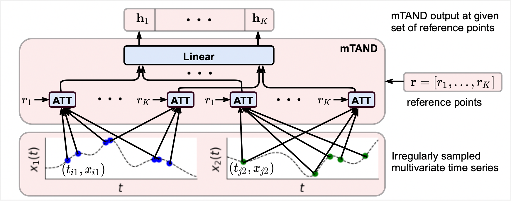
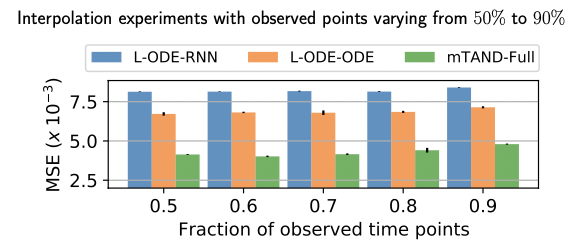
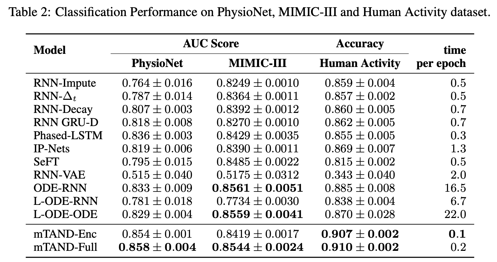

# Multi-Time Attention Networks (mTANs)

This repository contains the PyTorch implementation for the paper [Multi-Time Attention Networks for Irregularly Sampled Time Series](https://openreview.net/forum?id=4c0J6lwQ4_) by [Satya Narayan Shukla](https://satyanshukla.github.io/) and [Benjamin M. Marlin](https://people.cs.umass.edu/~marlin). This work has been accepted at the [International Conference on Learning Representations](https://iclr.cc/), 2021.

> **Modernization note:** This fork has been updated to work with Python 3.11+ and PyTorch 2.x (originally written for Python 3.7 / PyTorch 1.4.0).

<p align="center">
  
</p>

## Requirements

Python **3.11+** is required. The file [requirements.txt](requirements.txt) contains the full list of required packages.

```
numpy>=1.24
scikit-learn>=1.3
torch>=2.0.0
torchvision>=0.15.0
```

### Setup with conda (recommended)

```bash
conda create -n mtan311 python=3.11 -y
conda activate mtan311
pip install -r requirements.txt
```

### Setup with pip

```bash
pip install -r requirements.txt
```

## PhysioNet 2012 Data

The PhysioNet 2012 dataset requires a free account and data use agreement:

1. Register at [physionet.org](https://physionet.org) and accept the [Challenge 2012](https://physionet.org/content/challenge-2012/) agreement
2. Download the following files from `https://physionet.org/files/challenge-2012/1.0.0/`:
   - `set-a.tar.gz`
   - `set-b.tar.gz`
   - `Outcomes-a.txt`
3. Place them in `data/physionet/PhysioNet/raw/`

The first training run will automatically extract and preprocess the data (~3–5 min).

## Training and Evaluation

All scripts should be run from the `src/` directory:

```bash
cd src
```

### 1. Interpolation Task — Toy Dataset

```bash
python3 tan_interpolation.py --niters 5000 --lr 0.0001 --batch-size 128 \
  --rec-hidden 32 --latent-dim 1 --length 20 --enc mtan_rnn --dec mtan_rnn \
  --n 1000 --gen-hidden 50 --save 1 --k-iwae 5 --std 0.01 --norm \
  --learn-emb --kl --seed 0 --num-ref-points 20 --dataset toy
```

### 2. Interpolation Task — PhysioNet 2012

```bash
python3 tan_interpolation.py --niters 500 --lr 0.001 --batch-size 32 \
  --rec-hidden 64 --latent-dim 16 --quantization 0.016 --enc mtan_rnn \
  --dec mtan_rnn --n 8000 --gen-hidden 50 --save 1 --k-iwae 5 --std 0.01 \
  --norm --learn-emb --kl --seed 0 --num-ref-points 64 \
  --dataset physionet --sample-tp 0.9
```

### 3. Classification Task — PhysioNet 2012 (mTAND-Full, VAE + classifier)

```bash
python3 tan_classification.py --alpha 100 --niters 300 --lr 0.0001 \
  --batch-size 50 --rec-hidden 256 --gen-hidden 50 --latent-dim 20 \
  --enc mtan_rnn --dec mtan_rnn --n 8000 --quantization 0.016 --save 1 \
  --classif --norm --kl --learn-emb --k-iwae 1 --dataset physionet
```

### 4. Classification Task — PhysioNet 2012 (mTAND-Enc, encoder only)

Faster variant with encoder-only architecture. Verified on Python 3.11 / torch 2.10:

```bash
python3 tanenc_classification.py --niters 30 --lr 0.001 --batch-size 50 \
  --rec-hidden 128 --embed-time 128 --num-heads 1 --learn-emb \
  --n 8000 --quantization 0.1 --save 1 --classif \
  --dataset physionet --seed 0
```

> **Note:** 30 iterations is sufficient — the model overfits after ~30–50 iterations (train accuracy reaches 0.99+ while validation metrics degrade).

### 5. Classification Task — MIMIC-III (mTAND-Full)

For MIMIC-III, first obtain access [here](https://mimic.physionet.org/gettingstarted/access/) and follow the extraction process from [interp-net](https://github.com/mlds-lab/interp-net).

```bash
python3 tan_classification.py --alpha 5 --niters 300 --lr 0.0001 \
  --batch-size 128 --rec-hidden 256 --gen-hidden 50 --latent-dim 128 \
  --enc mtan_rnn --dec mtan_rnn --save 1 --classif --norm \
  --learn-emb --k-iwae 1 --dataset mimiciii
```

### 6. Classification Task — MIMIC-III (mTAND-Enc)

```bash
python3 tanenc_classification.py --niters 200 --lr 0.0001 --batch-size 256 \
  --rec-hidden 256 --enc mtan_enc --quantization 0.016 --save 1 \
  --classif --num-heads 1 --learn-emb --dataset mimiciii --seed 0
```

### 7. Classification Task — Human Activity Dataset (mTAND-Enc)

```bash
python3 tanenc_classification.py --niters 1000 --lr 0.001 --batch-size 256 \
  --rec-hidden 512 --enc mtan_enc_activity --quantization 0.016 --save 1 \
  --classif --num-heads 1 --learn-emb --dataset activity \
  --seed 0 --classify-pertp
```

## Interpolation Results

Interpolation performance on PhysioNet with varying percent of observed time points:

<p align="center">
  
</p>

## Classification Results

### Reproduced results — PhysioNet 2012 (mTAND-Enc)

Verified on **Python 3.11.15**, **PyTorch 2.10.0**, **NumPy 2.4.3**, **scikit-learn 1.8.0**, CPU.

| Iter | Val loss | Val acc | Test acc | Test AUC |
|------|----------|---------|----------|----------|
| 6    | **0.2672** | 0.8969  | 0.8762   | 0.824    |
| 14   | 0.2796   | 0.8953  | 0.8788   | **0.834** |
| 30   | 0.2673   | 0.9047  | 0.8738   | 0.809    |

- Best checkpoint (by val_loss): Test AUC = **0.824**
- Peak Test AUC: **0.834** at iter 14
- Training time (30 iters, CPU): ~60 sec
- The model overfits after ~30 iterations; early stopping recommended

### Original paper results

Classification performance on PhysioNet, MIMIC-III and Human Activity dataset:

<p align="center">
  
</p>

## Compatibility Notes

Changes made relative to the original code for Python 3.11+ / PyTorch 2.x compatibility:

- `torch.load(..., weights_only=False)` — required since PyTorch 2.4
- `tar.extractall(..., filter='data')` — Python 3.12 security requirement
- Removed `?download` suffix from PhysioNet URLs for clean filenames
- Fixed Python 2-style iterator: `dataloader.__iter__().next()` → `next(iter(dataloader))`
- `np.max(list)` → `max(list)` for NumPy 2.x compatibility

## Reference

```bibtex
@inproceedings{
shukla2021multitime,
title={Multi-Time Attention Networks for Irregularly Sampled Time Series},
author={Satya Narayan Shukla and Benjamin Marlin},
booktitle={International Conference on Learning Representations},
year={2021},
url={https://openreview.net/forum?id=4c0J6lwQ4_}
}
```
